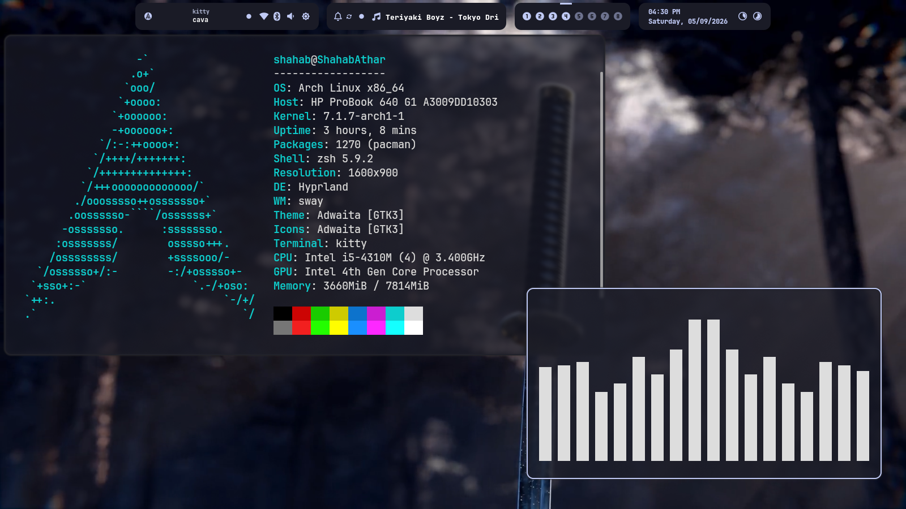
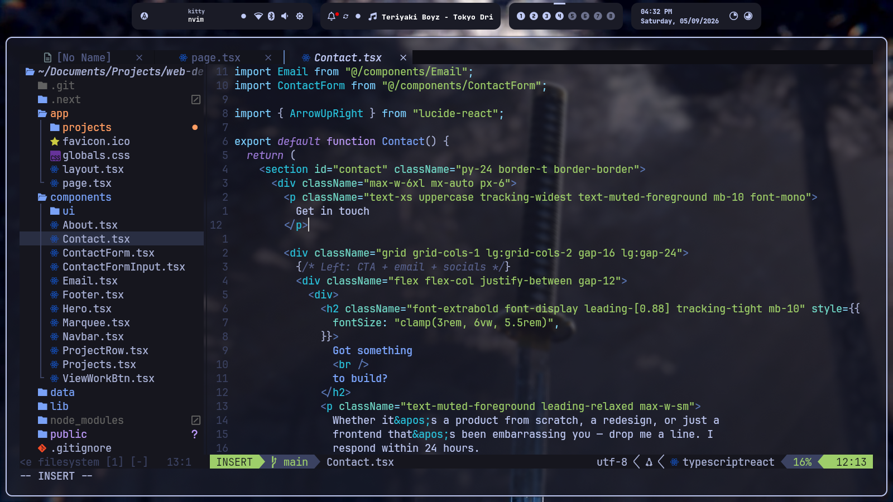
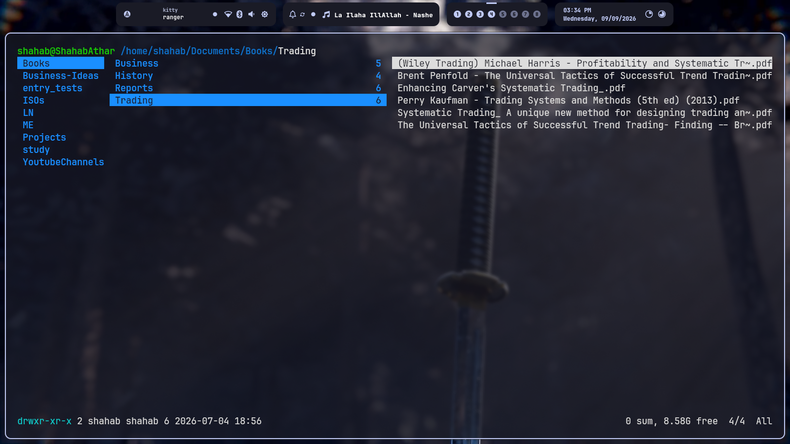
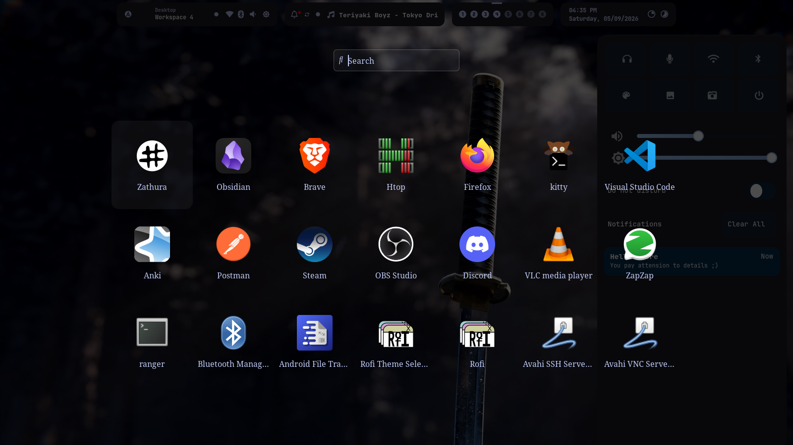
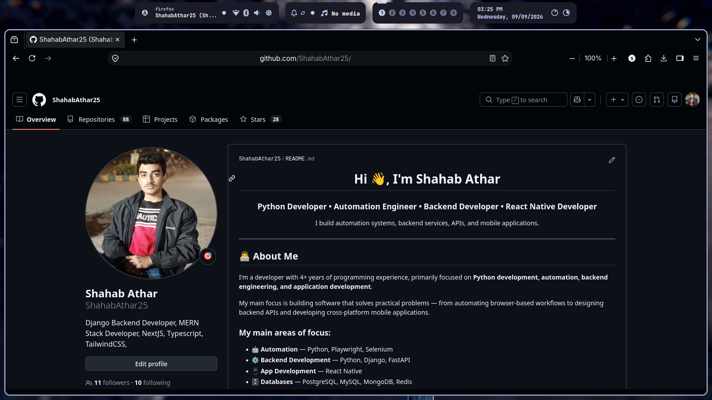

# dotfiles

A minimal, keyboard-driven Linux development environment.

## Showcase

### Desktop Overview


### Terminal & Editor
| Neovim | File Manager |
| :---: | :---: |
|  |  |

### Navigation & Web
| Application Launcher | Web Browser |
| :---: | :---: |
|  |  |

---

## System Overview

* **OS:** Arch Linux
* **Window Manager / Compositor:** Hyprland
* **Legacy WM:** Qtile + Picom (X11)
* **Terminal:** Kitty
* **Editor:** Neovim
* **Launcher:** Rofi
* **Bar & Notifications:** Waybar / SwayNC

---

## Installation

> [!WARNING]
> Backup your existing configuration files in `~/.config` before stowing.

### 1. Prerequisites

Install git and stow:

```bash
sudo pacman -S --needed git stow

```

### 2. Clone & Deploy

Clone the repository to your home directory and setup dotfiles using GNU Stow:

```bash
# Clone repository
git clone git@github.com:ShahabAthar25/dotfiles.git ~/.dotfiles
cd ~/.dotfiles

# Deploy configurations via GNU Stow
stow  hyperland kitty neofetch nvim rofi starship swaync tmux waybar zathura

# If you want to use my scripts for bluetooth, wifi, and screenshot
stow scripts

# If you also want to have qtile as a fallback window manager
stow qtile picom
```

---

## Keybindings

### General & Applications
| Keybinding | Action |
| --- | --- |
| `Super + Return` | Launch Terminal |
| `Super + E` | Launch File Manager |
| `Super + R` | Launch Application Menu |
| `Super + C` | Close Active Window |
| `Super + Ctrl + Q` | Exit Hyprland / Session Shutdown |
| `Super + Alt + L` | Lock Screen |

### Window Management & Layout
| Keybinding | Action |
| --- | --- |
| `Super + F` | Toggle Fullscreen |
| `Super + T` | Toggle Floating Mode |
| `Super + P` | Toggle Pseudo Tiling |
| `Super + G` | Toggle Split Direction (Dwindle) |
| `Super + Mouse Left Drag` | Move Window |
| `Super + Mouse Right Drag` | Resize Window |

### Navigation & Focus
| Keybinding | Action |
| --- | --- |
| `Super + H / J / K / L` | Focus Window (Left / Down / Up / Right) |
| `Super + Tab` | Focus Next Window |
| `Super + Shift + Tab` | Focus Previous Window |
| `Super + Shift + H / J / K / L` | Move Active Window (Left / Down / Up / Right) |
| `Super + [1-9, 0]` | Switch to Workspace 1–10 |
| `Super + Shift + [1-9, 0]` | Move Window to Workspace 1–10 |
| `Super + Ctrl + [1-9, 0]` | Move Window to Workspace 1–10 (Silent) |
| `Super + Mouse Scroll` | Cycle Through Workspaces |
| `Super + S` | Toggle Special Workspace (Scratchpad) |
| `Super + Shift + S` | Move Window to Special Workspace |

### Menus & Control Center
| Keybinding | Action |
| --- | --- |
| `Super + M` | Wi-Fi Menu |
| `Super + N` | Bluetooth Menu |
| `Super + I` | Toggle Notification Center (SwayNC) |

### Screenshots
| Keybinding | Action |
| --- | --- |
| `Print` | Capture Full Screen |
| `Shift + Print` | Capture Active Window |
| `Super + Shift + S` | Capture Region Selection |

### Hardware & Media Controls
| Keybinding | Action |
| --- | --- |
| `XF86AudioRaiseVolume` | Volume Up (+5%) |
| `XF86AudioLowerVolume` | Volume Down (-5%) |
| `XF86AudioMute` | Toggle Audio Mute |
| `XF86AudioMicMute` | Toggle Microphone Mute |
| `XF86MonBrightnessUp` | Screen Brightness Up (+5%) |
| `XF86MonBrightnessDown` | Screen Brightness Down (-5%) |
| `XF86AudioPlay / Pause` | Play / Pause Media |
| `XF86AudioNext` | Next Track |
| `XF86AudioPrev` | Previous Track |
